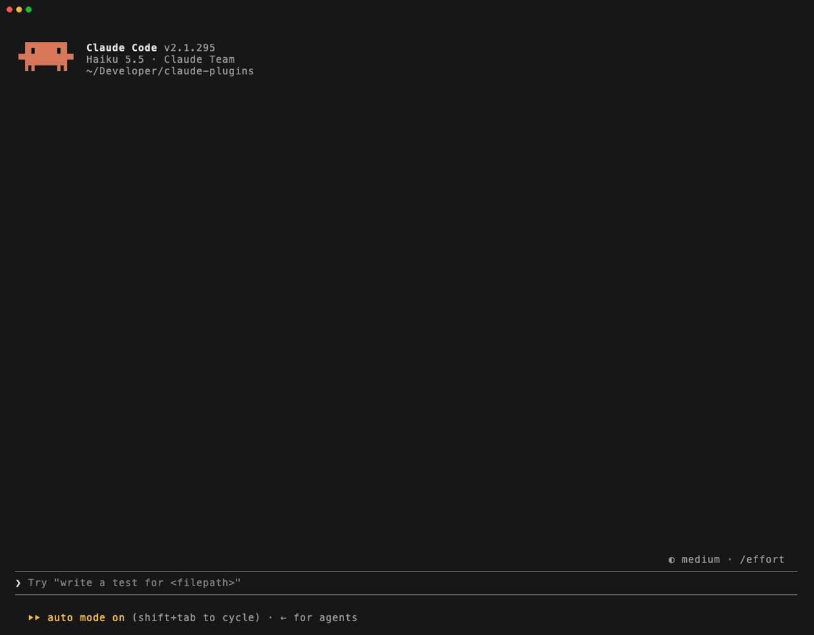

# claude-plugins

Mods for Claude Code: plugins of function hooks that change how the terminal looks and behaves.



| Mod | What it does |
| --- | --- |
| [readable](readable/README.md) | Draws replies and prompts as styled Markdown, with solid panels for code, quotes, prompts and pastes |
| [agent-progress](agent-progress/README.md) | A band above the prompt: the running command against its usual time, context fill, CI after a push, questions waiting on you, workflow progress |
| [gh-account](gh-account/README.md) | Runs `gh` and git network commands as the right GitHub account for the folder or org, with no `gh auth switch` |

## Install

In a Claude Code session, install any of them by name:

```
/plugin install readable --marketplace emilthaudal/claude-plugins
/plugin install agent-progress --marketplace emilthaudal/claude-plugins
/plugin install gh-account --marketplace emilthaudal/claude-plugins
```

Answer `y` to add the marketplace, then pick a scope. Each mod's options are in its README and in `/config`.

## Develop

Load a mod from a clone instead, in every session, by naming its folder in `~/.claude/settings.json` (several folders separated by `:`):

```json
{ "env": { "CLAUDE_CODE_PLUGIN_DIRS": "~/Developer/claude-plugins/readable" } }
```

Saving a file reloads the mod in running sessions. Check a mod with:

```
claude plugin validate <mod>
claude plugin test <mod>
```

Re-record the demo with [VHS](https://github.com/charmbracelet/vhs) from the repo root: `vhs docs/demo.tape`.
